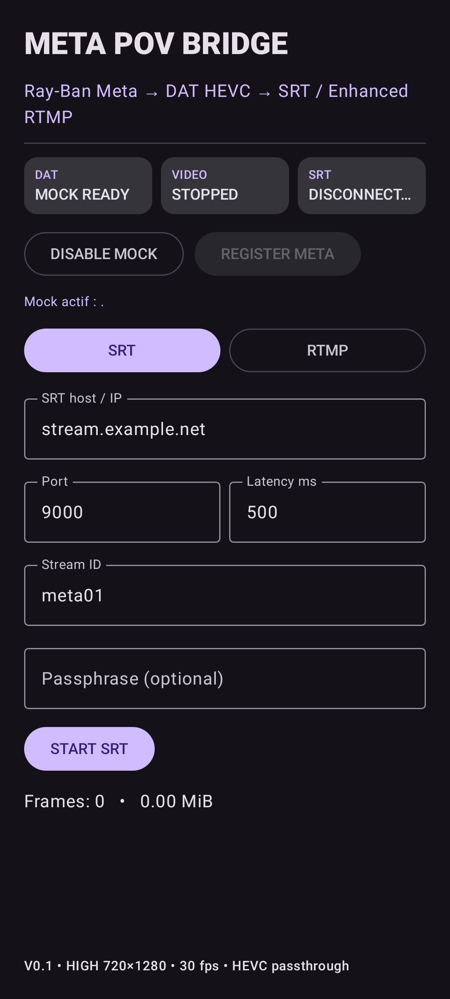
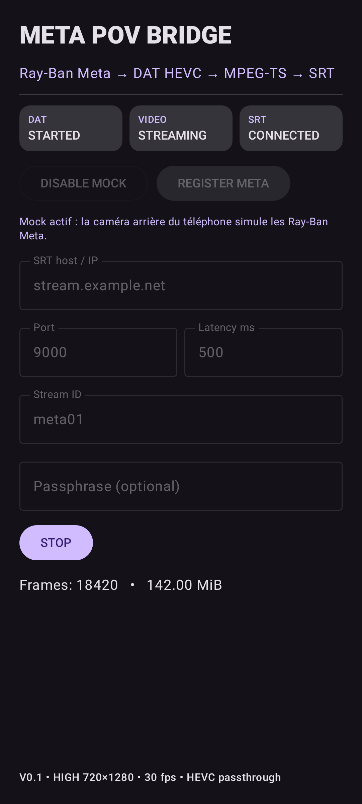

# Meta POV Bridge — V0.1

Android proof of concept for a direct, self-hosted POV contribution chain:

**Ray-Ban Meta → Meta Wearables DAT → Android → HEVC → SRT or Enhanced RTMP → our server / production**

No third-party streaming cloud is required by the target architecture.

## Current status

Reference date: **2026-09-29**

- ✅ Android project builds in GitHub Actions.
- ✅ Debug APK is produced as the `MetaPOVBridge-debug` artifact.
- ✅ Meta Wearables DAT `1.0.0`.
- ✅ Developer Mode credentials default to `0`, as documented by Meta; production credentials can be supplied through Gradle properties.
- ✅ Compressed HEVC camera request: HIGH / 720×1280 / 30 fps.
- ✅ Video-only MPEG-TS muxer.
- ✅ HEVC VPS/SPS/PPS are cached and re-injected on keyframes for receivers joining after stream start.
- ✅ SRT caller with LIVE transport mode, latency, Stream ID and optional passphrase.
- ✅ Enhanced RTMP transport implemented with direct HEVC passthrough (`hvc1`), without Android video re-encoding.
- ✅ SRT / RTMP transport selector in the app UI.
- ✅ 1316-byte SRT payload chunks for MPEG-TS transport.
- ✅ Android foreground service and partial WakeLock for background / screen-locked operation.
- ✅ Meta Mock Device Kit integration.
- ✅ Phone rear camera can simulate Ray-Ban Meta for development without glasses.
- ✅ Compose UI previews: Idle, Mock Ready, Streaming and Error.
- ✅ BlueStacks Mock VIDEO FILE → DAT → HEVC → MPEG-TS → SRT → Restreamer is validated with a visible 30 fps picture.
- ⚠️ Enhanced RTMP publish connects and sends frames, but the current Restreamer process exits with `Error opening output files: Invalid argument`; receiver-side compatibility is still under investigation.
- ⏳ Real Ray-Ban Meta validation.
- ⏳ Audio transport.

Detailed state: [`docs/PROJECT_STATUS.md`](docs/PROJECT_STATUS.md).

## Test modes

### Real glasses

`REGISTER META` starts the official Meta registration flow, then the app creates a DAT session and requests the glasses camera stream.

### Mock / no glasses

Two MockDeviceKit sources are available:

- `PHONE CAMERA` uses the Android rear camera and is intended for a physical Android phone.
- `VIDEO FILE` lets the user select an H.264/H.265 file and is the preferred emulator/BlueStacks path because virtual cameras are not always exposed to MockDeviceKit as a usable Android handset camera.

Both modes create simulated Ray-Ban Meta glasses and keep the transport chain unchanged:

`mock source → Mock Ray-Ban → DAT → compressed HEVC → SRT or Enhanced RTMP`

## Transport modes

### SRT

`DAT HEVC → HEVC normalizer → MPEG-TS → SRT LIVE → Restreamer`

The MPEG-TS path caches VPS/SPS/PPS and re-injects them on keyframes so a receiver that attaches after stream start can recover the HEVC decoder configuration.

### Enhanced RTMP

`DAT HEVC → HEVC normalizer → Enhanced RTMP hvc1 → Restreamer`

The RTMP path uses RootEncoder's RTMP transport/packetizer. DAT's already compressed HEVC frames are passed directly; the phone does **not** decode and re-encode the video.

See [`docs/RTMP_END_TO_END_TEST.md`](docs/RTMP_END_TO_END_TEST.md).

## UI previews

The real UI and the preview simulations use the same `BridgeScreenContent` composable.

Preview states are defined directly in `MainActivity.kt`:

- Idle
- Mock ready
- Streaming
- Error

This lets us review the interface before using a physical phone. A separate workflow renders PNG references into the `MetaPOVBridge-ui-screenshots` artifact and publishes stable copies under `docs/images/ui/`. See [`docs/UI_PREVIEWS.md`](docs/UI_PREVIEWS.md).

  
  

## CI / APK

Every push to `main` builds a debug APK.

Workflow: `.github/workflows/build-apk.yml`

Artifact: `MetaPOVBridge-debug`

Pull requests also include a documentation-sync check: application/build changes must update either this README or a file under `docs/`.

## V0.1 limits

- Video only.
- Real-glasses behavior is not yet validated.
- Long-duration stability and network recovery are not yet qualified.
- Audio is intentionally deferred until the video transport path is validated.
- This is not yet production-qualified for an event.

## Acceptance path

First software milestone:

`Mock → DAT HEVC → SRT or Enhanced RTMP → Restreamer → visible 720×1280 picture`

Then:

`Ray-Ban Meta → DAT → same pipeline`

Initial stability target: **15 minutes continuous video with no app/process crash and a clean receiver stream**.

End-to-end procedure: [`docs/SRT_END_TO_END_TEST.md`](docs/SRT_END_TO_END_TEST.md).

## Documentation rule

A feature is not considered complete until its documentation/status is updated in the same change.
